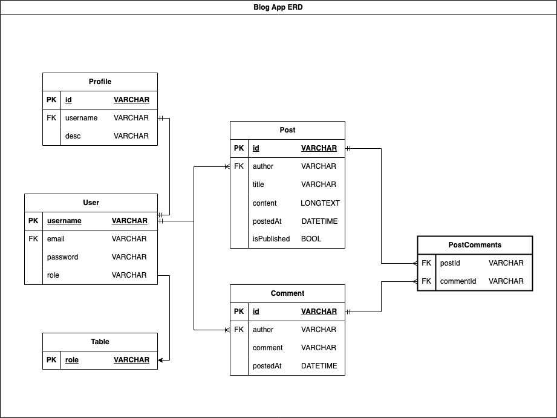
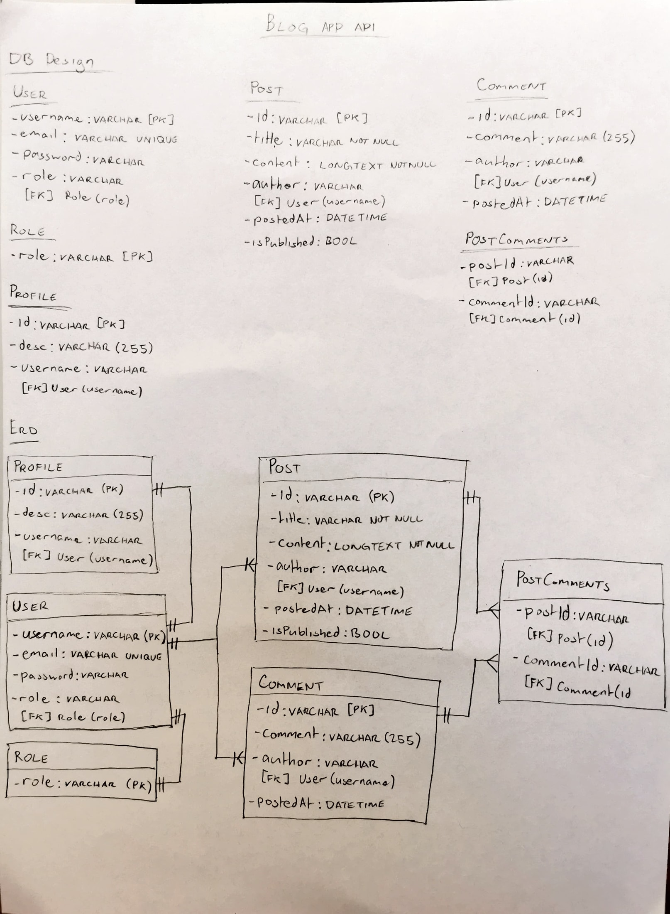
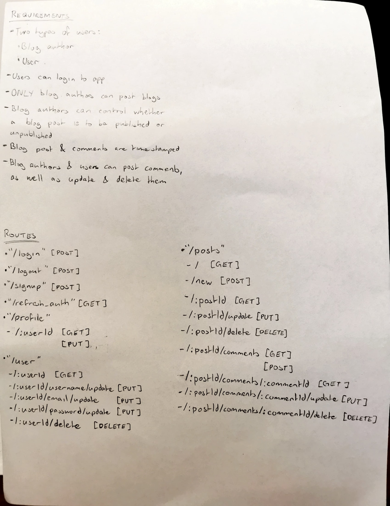

# Blog API

A simple blog api demonstrating an understanding of APIs using express, passport, prisma &amp; jwt

## App Design

### Requirements

- Two types of users: Blog author & Reader
- All USERS can login to app
- All USERS can view blogs and associated comments
- AUTHENTICATED Blog authors can post blogs
- AUTHENTICATED Blog authors can control whether a blog post is published or unpublished (hidden)
- Blog post & comments are timestamped
- Blog authors & users can post comments, update them & delete them

### ERD

### Written Design

